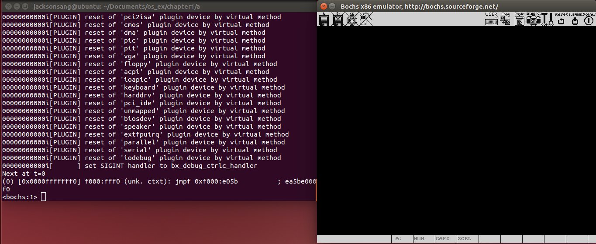
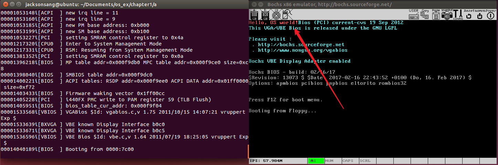
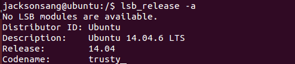
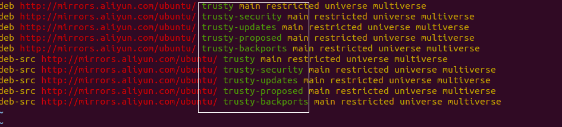
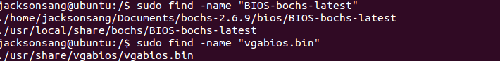
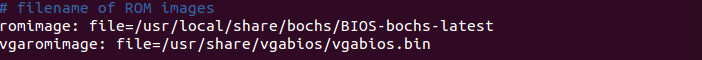
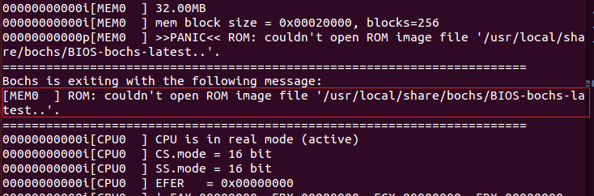
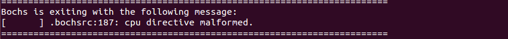

# week1

## 实验内容

1. 认真阅读章节资料

2. 在实验机上安装虚拟运行环境，并安装ubuntu（实验室机器已安装，若需要可在自己笔记本电脑另行安装）

3. 安装ubuntu开发环境，32位环境

4. 下载bochs源码，编译并安装bochs环境

5. 使用bochs自带工具bximage创建虚拟软驱

6. 阅读、编译boot.asm，并反汇编阅读

7. 修改bochsrc，运行并调试你的第一个程序

8. 完成实验练习要求

## 实验步骤

1. 下载virtualbox或vmware

2. 下载32位ubuntu镜像文件并安装

   * [14.06](https://mirrors.163.com/ubuntu-releases/14.04/ubuntu-14.04.6-desktop-i386.iso)
   * [16.06](https://mirrors.163.com/ubuntu-releases/16.04/ubuntu-16.04.6-desktop-i386.iso)

3. 修改ubuntu源(可选)

   1. 首先要清楚自己Ubuntu的版本信息

   2. 搜索对应版本Ubuntu的apt源

      * Ubuntu16.04 apt源（阿里）

        ```
        deb-src http://archive.ubuntu.com/ubuntu xenial main restricted #Added by software-properties
        deb http://mirrors.aliyun.com/ubuntu/ xenial main restricted
        deb-src http://mirrors.aliyun.com/ubuntu/ xenial main restricted multiverse universe #Added by software-properties
        deb http://mirrors.aliyun.com/ubuntu/ xenial-updates main restricted
        deb-src http://mirrors.aliyun.com/ubuntu/ xenial-updates main restricted multiverse universe #Added by software-properties
        deb http://mirrors.aliyun.com/ubuntu/ xenial universe
        deb http://mirrors.aliyun.com/ubuntu/ xenial-updates universe
        deb http://mirrors.aliyun.com/ubuntu/ xenial multiverse
        deb http://mirrors.aliyun.com/ubuntu/ xenial-updates multiverse
        deb http://mirrors.aliyun.com/ubuntu/ xenial-backports main restricted universe multiverse
        deb-src http://mirrors.aliyun.com/ubuntu/ xenial-backports main restricted universe multiverse #Added by software-properties
        deb http://archive.canonical.com/ubuntu xenial partner
        deb-src http://archive.canonical.com/ubuntu xenial partner
        deb http://mirrors.aliyun.com/ubuntu/ xenial-security main restricted
        deb-src http://mirrors.aliyun.com/ubuntu/ xenial-security main restricted multiverse universe #Added by software-properties
        deb http://mirrors.aliyun.com/ubuntu/ xenial-security universe
        deb http://mirrors.aliyun.com/ubuntu/ xenial-security multiverse
        ```

      * Ubuntu14.04 apt源（阿里）

        ```
        deb http://mirrors.aliyun.com/ubuntu/ trusty main restricted universe multiverse
        deb http://mirrors.aliyun.com/ubuntu/ trusty-security main restricted universe multiverse
        deb http://mirrors.aliyun.com/ubuntu/ trusty-updates main restricted universe multiverse
        deb http://mirrors.aliyun.com/ubuntu/ trusty-proposed main restricted universe multiverse
        deb http://mirrors.aliyun.com/ubuntu/ trusty-backports main restricted universe multiverse
        deb-src http://mirrors.aliyun.com/ubuntu/ trusty main restricted universe multiverse
        deb-src http://mirrors.aliyun.com/ubuntu/ trusty-security main restricted universe multiverse
        deb-src http://mirrors.aliyun.com/ubuntu/ trusty-updates main restricted universe multiverse
        deb-src http://mirrors.aliyun.com/ubuntu/ trusty-proposed main restricted universe multiverse
        deb-src http://mirrors.aliyun.com/ubuntu/ trusty-backports main restricted universe multiverse
        ```

   3. 修改/etc/apt/sources.list文件

4. bochs下载（源码下载）

   * 版本：2.6.9
   * 链接：[http://bochs.sourceforge.net/getcurrent.html](http://bochs.sourceforge.net/getcurrent.html)

5. 安装依赖库

   需要安装build-essential、libx11-dev、libxrandr-dev、libsdl1.2-dev、vgabios、bximage，可在编译过程中发现

   ```shell
   sudo apt install build-essential libx11-dev libxrandr-dev libsdl1.2-dev vgabios bximage
   ```

6. 编译和安装bochs

   1. 配置

      在bochs源码文件夹下运行命令```./configure --withsdl --enable-debugger --enable-disasm```

		```{admonition} 提示

		如果运行该命令后出现warning: --enable-disasm xxxx这种警告，表示不需要加该参数，disasm模块已经默认设置好，继续下一步即可
		```

   2. 安装

      运行命令```sudo make```

   3. 下载

      运行命令```sudo make install```

7. 下载本书源码

   * QQ群内提供iso.gz文件

   * 直接从github上[下载](https://github.com/yyu/osfs00/blob/master/osfromscratch2010.iso.gz)

	```{caution}

	不建议在windows系统中提取出iso中的文件然后传入ubuntu中，原因是windwos和linux中换行符存在差异，导致跨系统文件有时不能正常工作。

	同时在linux中挂载好iso后将文件拷贝出去，不要直接在挂载目录下运行，因为该iso为只读文件，导致后续命令出现问题
	```

8. 修改源码文件中的bochsrc

   * 修改vgaromimage对应的文件位置，以你的实际安装位置为准

   * 注释掉keyboard_mapping一行

   * 增加display_library: sdl（某些linux下该项可选）

9. 制作可启动软盘

   1. 编译源码

      ```shell
      nasm boot.asm –o boot.bin
      ```

   2. 产生虚拟软驱

      ```shell
      bximage
      ```

   3. 写引导盘

      ```shell
      dd if=boot.bin of=a.img bs=512 count=1 conv=notrunc
      ```

10. 启动

    ```shell
    bochs –f ./bochsrc
    ```

    

    在bochs中输入字符c，表示继续运行，此时可以看到"Hello , OS world"

    

## FAQ

### Q: apt安装一些包时产生依赖无法解决

apt产生依赖报错一般是是源的问题，新手很容易出现源的版本和ubuntu版本不适配问题。检查步骤如下

命令行输入```lsb_release -a"命令，查看codename（以ubuntu14.04为例）



可以看到对应的code那么为trusty，查看/etc/apt/sources.list中对应的源版本，检查是否一致，如果为xenial说明使用了ubuntu16的apt源。



### Q: 如何在虚拟机和宿主机之间传递文件

1. 共享文件夹（需要自己摸索）
2. 邮件传递
3. 使用相关网站如[奶牛快传](https://cowtransfer.com/)，在主机中上传文件，在虚拟机中下载文件

### Q: 安装bochs源码时迟迟未弹出下载窗口

由于网络的问题，在sourceforge下载bochs源码时确实需要等待一段时间，请耐心等候30秒。

30秒已过你有点等不及了，可以使用wget命令，直接在命令行中输入``` wget https://sourceforge.net/projects/bochs/files/bochs/2.6.9/bochs-2.6.9.tar.gz```进行下载

### Q: 如何找到vgaromimage和romimage的对应文件位置

使用find命令在根目录下寻找文件"BIOS-bochs-latest"和"vgabios.bin"文件。



将结果写入bochsrc中



### Q: tar.gz、gz、iso这些文件要怎么用

对于使用命令行的同学，我相信你已经熟悉linux了，这些知识谷歌一下就出来了。

对于使用图形化界面的同学，就更为简单了，tar.gz和gz都是压缩包，右键点击文件解压缩即可，iso文件需要挂在到linux中，同样右键点击文件挂载(mount)即可。

### Q: bochs报错cannot open rom image file xxxx



很简单，请检查romimage路径是否正确。

### Q: bochs报错cpu directive malformed 



很有可能是因为在bochs-2.6.9的源码目录下直接运行了bochs，请到本书配套源码的目录下运行bochs，并修改好bochsrc，以及使用```-f```指定bochsrc的位置。